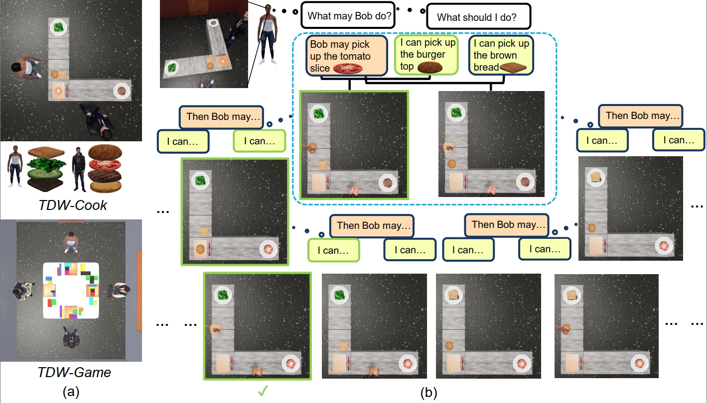

# COMBO: Compositional World Models for Embodied Multi-Agent Cooperation

This repo contains codes for the following paper:

_Hongxin Zhang*, Zeyuan Wang*, Qiushi Lyu*, Zheyuan Zhang, Sunli Chen, Tianmin Shu, Yilun Du, Chuang Gan_: COMBO: Compositional World Models for Embodied Multi-Agent Cooperation

Project Website: [COMBO](https://vis-www.cs.umass.edu/combo/)



## Getting started  

### Installation

We recommend installing dependencies using conda.   

```bash  
conda env create -f environment.yml
conda activate combo
```

If you're running TDW on a remote Linux server, follow the [TDW Installation Document](https://github.com/threedworld-mit/tdw/blob/master/Documentation/lessons/setup/install.md) to configure the X server.


### Run Experiments

We prepare example scripts to run experiments under the folder `scripts`.

For example, to run experiments with _COMBO_ agents on `TDW-Game`, run the following command in folder `tdw_mat`.

```bash
./scripts/run_game.sh
```


## Acknowledgement

This repository is built upon the codebase of [AVDC](https://github.com/flow-diffusion/AVDC) and [LLaVA](https://github.com/haotian-liu/LLaVA).

## Citation
If you find our work useful, please consider citing:
```
@article{zhang2024combo,
      title={COMBO: Compositional World Models for Embodied Multi-Agent Cooperation}, 
      author={Hongxin Zhang and Zeyuan Wang and Qiushi Lyu and Zheyuan Zhang and Sunli Chen and Tianmin Shu and Yilun Du and Chuang Gan},
      year={2024},
      journal = {arXiv preprint arXiv:2404.10775},
}
```
